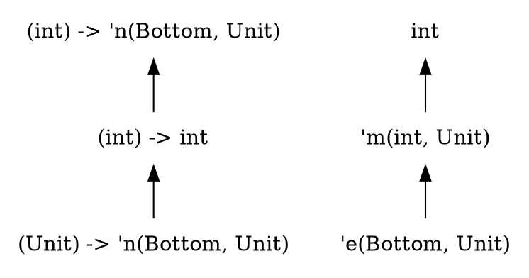

```dot
digraph order {
  node [
    shape = none
  ];
  edge [
    dir = back
  ];
  "(int) -> 'n(Bottom, Unit)"
  "'e(Bottom, Unit)"
  "'m(int, Unit)"
  "int"
  "(int) -> int"
  "(Unit) -> 'n(Bottom, Unit)"
  "'m(int, Unit)" -> "'e(Bottom, Unit)"
  "int" -> "'m(int, Unit)"
  "(int) -> 'n(Bottom, Unit)" -> "(int) -> int"
  "(int) -> int" -> "(Unit) -> 'n(Bottom, Unit)"
}
```