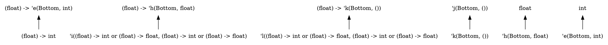

```dot
digraph order {
  node [
    shape = none
  ];
  edge [
    dir = back
  ];
  "(float) -> 'e(Bottom, int)"
  "(float) -> 'h(Bottom, float)"
  "'i((float) -> int or (float) -> float, (float) -> int or (float) -> float)"
  "'l((float) -> int or (float) -> float, (float) -> int or (float) -> float)"
  "'k(Bottom, ())"
  "'h(Bottom, float)"
  "'e(Bottom, int)"
  "'j(Bottom, ())"
  "float"
  "int"
  "(float) -> int"
  "(float) -> 'k(Bottom, ())"
  "(float) -> 'e(Bottom, int)" -> "(float) -> int"
  "float" -> "'h(Bottom, float)"
  "'j(Bottom, ())" -> "'k(Bottom, ())"
  "int" -> "'e(Bottom, int)"
  "(float) -> 'h(Bottom, float)" -> "'i((float) -> int or (float) -> float, (float) -> int or (float) -> float)"
  "(float) -> 'k(Bottom, ())" -> "'l((float) -> int or (float) -> float, (float) -> int or (float) -> float)"
}
```